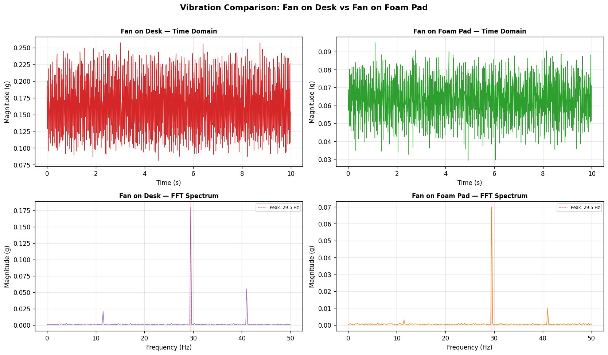
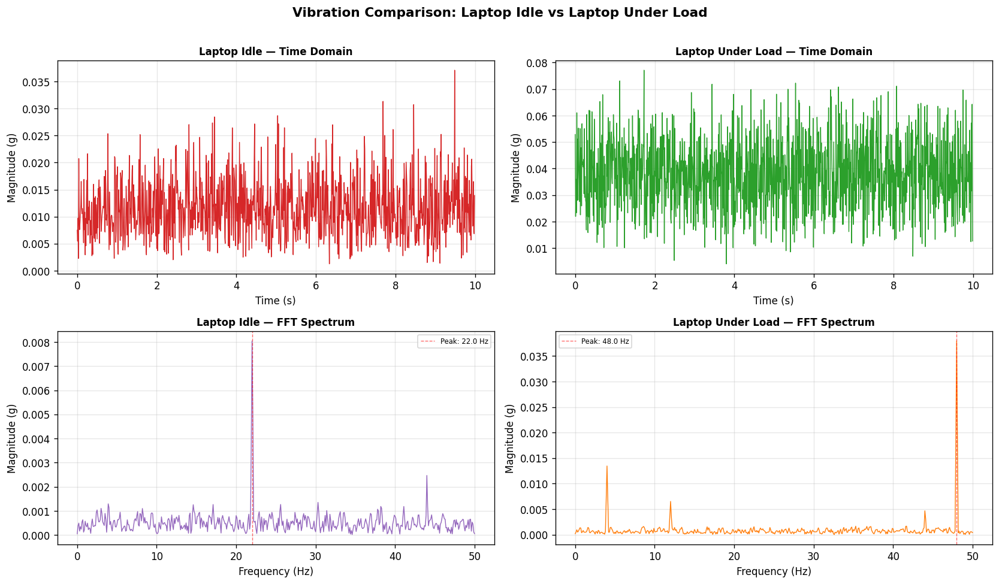
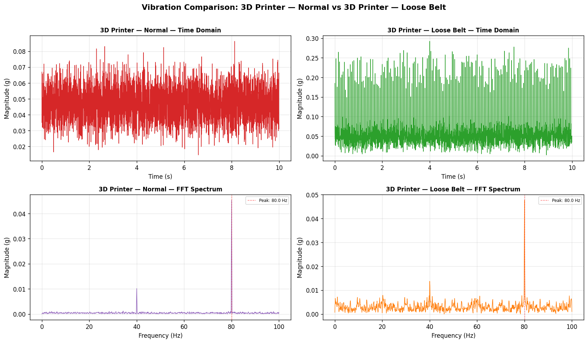

# VibeCheck — Vibration Analyzer


A lightweight Python tool for analyzing vibration data from phone accelerometers and low-cost sensors. VibeCheck cleans raw CSV signals, computes vibration metrics, runs FFT frequency analysis, generates plots, and produces plain-English diagnostic reports — no specialized hardware required.

---

## Example Output

**Fan on desk vs fan on foam pad** — the foam pad cuts RMS vibration by 62%



**Laptop idle vs under CPU load** — fan spins up from 22 Hz to 48 Hz under load



**3D printer normal vs loose belt** — same dominant frequency, crest factor jumps from 1.80 → 3.47



---

## Motivation

I built this project to combine my mechanical engineering background with Python-based data analysis and software development. Vibration analysis is commonly used in mechanical systems to understand imbalance, resonance, looseness, damping, and operating frequency behavior.

Instead of relying on specialized industrial equipment, this project focuses on lightweight experiments using phone accelerometer data or inexpensive sensors. The goal is to show how real-world sensor data can be processed, visualized, and interpreted through a clean Python workflow.

---

## Features

- Load accelerometer CSV files with automatic column name detection
- Clean and preprocess raw acceleration data
- Remove gravity effects and detrend the signal
- Calculate RMS vibration, peak acceleration, and crest factor
- Run FFT analysis with Hann windowing to reduce spectral leakage
- Detect dominant vibration frequency and top spectral peaks
- Compare before and after vibration tests
- Generate time-domain signal plots and FFT spectrum plots
- Generate before/after side-by-side comparison plots
- Produce plain-English diagnostic interpretations
- Generate and save summary reports
- Run analysis from the command line
- Explore results interactively in a Streamlit dashboard

---

## Use Cases

- Comparing a fan on a desk versus a fan on a foam pad
- Measuring vibration from a laptop fan at idle vs under load
- Detecting a loose belt on a 3D printer from crest factor changes
- Checking vibration patterns from a bike handlebar on different surfaces
- Studying how damping changes RMS vibration and frequency content

---

## Tech Stack

- [Python 3.9+](https://www.python.org/)
- [NumPy](https://numpy.org/) — signal math
- [Pandas](https://pandas.pydata.org/) — data loading and handling
- [SciPy](https://scipy.org/) — filtering and FFT
- [Matplotlib](https://matplotlib.org/) — plotting
- [Streamlit](https://streamlit.io/) — interactive dashboard
- [Pytest](https://pytest.org/) — testing

---

## Installation

```bash
git clone https://github.com/mhaklee/vibecheck-vibration-analyzer.git
cd vibecheck-vibration-analyzer
pip install -r requirements.txt
```

Or install as a package:

```bash
pip install -e .
```

---

## CSV Format

VibeCheck expects a CSV file with at least three acceleration columns and an optional timestamp column. Column names are case-insensitive and common variants are accepted automatically.

| Column | Required | Accepted names |
|---|---|---|
| timestamp | No (synthesised if missing) | `timestamp`, `time`, `t`, `seconds`, `elapsed` |
| x | Yes | `x`, `ax`, `accel_x`, `acceleration_x`, `x_axis` |
| y | Yes | `y`, `ay`, `accel_y`, `acceleration_y`, `y_axis` |
| z | Yes | `z`, `az`, `accel_z`, `acceleration_z`, `z_axis` |

**Example:**
```
timestamp,x,y,z
0.00,0.012,-0.003,0.998
0.01,0.015,-0.001,0.995
0.02,0.009,-0.005,1.001
```

Units can be g or m/s² — VibeCheck does not convert between them, so keep units consistent across files you compare.

Sample data files are in [`data/`](data/) and were recorded at 100 Hz (200 Hz for the 3D printer files).

---

## Usage

### Command Line

**Analyze a single file:**
```bash
vibecheck analyze data/fan_on_desk.csv --save-report
```

**Analyze with options:**
```bash
vibecheck analyze data/laptop_under_load.csv \
    --label "Laptop load test" \
    --axis x \
    --n-peaks 5 \
    --lowpass \
    --lowpass-cutoff 80 \
    --save-report \
    --output-dir outputs/
```

**Compare two files:**
```bash
vibecheck compare data/fan_on_desk.csv data/fan_on_foam.csv \
    --label-before "Fan on desk" \
    --label-after "Fan on foam pad" \
    --save-report
```

**Available flags:**

| Flag | Description |
|---|---|
| `--label` | Display label for the test |
| `--sample-rate HZ` | Override sample rate (default: inferred from timestamps) |
| `--axis` | Axis for FFT analysis: `x`, `y`, `z`, or `magnitude` (default: `magnitude`) |
| `--n-peaks N` | Number of FFT peaks to detect (default: 5) |
| `--output-dir DIR` | Directory for plots and reports (default: `outputs/`) |
| `--no-gravity` | Skip gravity removal |
| `--gravity-method` | `mean` or `highpass` (default: `mean`) |
| `--no-detrend` | Skip linear detrending |
| `--lowpass` | Apply a low-pass Butterworth filter |
| `--lowpass-cutoff HZ` | Low-pass cutoff frequency (default: 50 Hz) |
| `--no-plots` | Skip plot generation |
| `--save-report` | Save the text report to the output directory |

### Streamlit Dashboard

```bash
streamlit run vibecheck/app.py
```

Upload a CSV, adjust cleaning and FFT settings in the sidebar, and explore metrics, plots, and reports interactively. Switch to **Before / After Comparison** mode to compare two files side by side.

### Python API

```python
from vibecheck import load_csv, infer_sample_rate, clean, get_all_metrics, run_fft_analysis, generate_report

df = load_csv("data/fan_on_desk.csv")
fs = infer_sample_rate(df)
df_clean = clean(df, fs=fs)

metrics = get_all_metrics(df_clean)
fft = run_fft_analysis(df_clean, fs=fs, axis="x", n_peaks=5)

report = generate_report(metrics, fft, label="Fan on desk", output_path="report.txt")
print(report)
```

---

## Example Workflow

1. Collect accelerometer data using a phone sensor app such as [phyphox](https://phyphox.org/) or [Physics Toolbox](https://www.vieyrasoftware.net/)
2. Export the recording as a CSV file
3. Run VibeCheck on the CSV
4. Review vibration metrics, FFT peaks, and plots
5. Generate a report
6. Run a second test under different conditions and compare

---

## Project Structure

```
vibecheck-vibration-analyzer/
├── vibecheck/
│   ├── __init__.py        # Public API
│   ├── loader.py          # CSV loading and column mapping
│   ├── cleaner.py         # Gravity removal, detrending, filtering
│   ├── metrics.py         # RMS, peak, crest factor
│   ├── fft_analysis.py    # FFT, dominant frequency, peak detection
│   ├── plotter.py         # Time-domain and FFT plots
│   ├── reporter.py        # Plain-English interpretation and reports
│   ├── comparator.py      # Before/after comparison
│   ├── cli.py             # Command-line interface
│   └── app.py             # Streamlit dashboard
├── tests/
│   ├── conftest.py        # Shared fixtures
│   ├── test_loader.py
│   ├── test_cleaner.py
│   ├── test_metrics.py
│   └── test_fft_analysis.py
├── data/
│   ├── fan_on_desk.csv
│   ├── fan_on_foam.csv
│   ├── laptop_idle.csv
│   ├── laptop_under_load.csv
│   ├── 3dprinter_normal.csv
│   └── 3dprinter_loose_belt.csv
├── docs/
│   ├── comparison_fan.png
│   ├── comparison_laptop.png
│   ├── comparison_3dprinter.png
│   └── sample_report.txt
├── .github/workflows/ci.yml
├── .gitignore
├── LICENSE
├── pyproject.toml
└── requirements.txt
```

---

## Running Tests

```bash
pytest tests/ -v
```

86 tests across loader, cleaner, metrics, and FFT analysis modules.

---

## License

MIT — see [LICENSE](LICENSE) for details.

---

## Author

[mhaklee](https://github.com/mhaklee)
